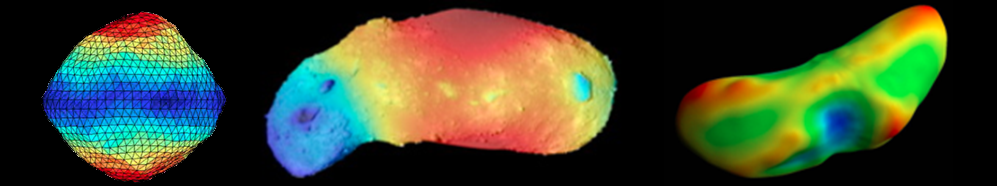

Gallery
=======

This is a blog-style collection of multimedia items related to DEMBody (graphics, animations, etc.). These items display an incomplete feature list of DEMBody, including `cohesion bridges`_, `polyhedron contact`_, `non-spherical particle elements`_, `irregular gravity field`_, `force chain identification`_, `shear/periodic boundary`_, and so on. You are welcome to use these items in presentations so long as they are appropriately cited.

Basic mechanical model
----------------------
In this code, any two grains, or one grain and a basic element, interact via Hertzian normal force and Mindlin–Deresiewicz tangential force, which are described by combinations of nonlinear springs, viscous dashpots and frictional sliders as shown in the figure bellow. 

In addition, real grains have a certain degree of non-sphericity. To account for this characteristic, a physically based elastic-plastic spring-dashpot rotational model proposed by Jiang, et al., which incorporates rolling and twisting forces, was implemented into DEMBody. 

For small rubble piles in a low-gravity, ultra-high-vacuum environment, the van der Waals force between constituent grains becomes relevant.  Therefore, inspired  by  the  granular  bridge idea proposed by Sánchez and Scheeres, a simple dry cohesion model was adopted to mimic the weak attractive inter-particle forces in asteroid regolith. Please refer to :ref:`our papers<Papers based on DEMBody>` for more details.

.. figure:: _static/DEMmodel.jpg 
   :align: center

.. table:: Mechanical models used in DEMBody
   :widths: auto
   :align: center
   
   =======================  ============================================================= 
   Component                 Description
   =======================  ============================================================= 
   Normal					           Hertz model, spring-dashpot [#]_
   Tangential		             Mindlin–Deresiewicz model, spring-dashpot-slider [#]_
   Rolling			             Jiang model, spring-dashpot-slider [3]_
   Twisting                  Jiang model, spring-dashpot-slider [3]_
   Juncture                  Scheeres model, dry cohesion bridge [#]_:sup:`,` [#]_
   =======================  ============================================================= 

.. rubric:: References

.. [#] Cundall, P. A., & Strack, O. D. (1979). A discrete numerical model for granular assemblies. geotechnique, 29(1), 47-65.
.. [#] Wada, K., Senshu, H., & Matsui, T. (2006). Numerical simulation of impact cratering on granular material. Icarus, 180(2), 528-545.
.. [3] Jiang, M., Shen, Z., & Wang, J. (2015). A novel three-dimensional contact model for granulates incorporating rolling and twisting resistances. Computers and Geotechnics, 65, 147-163.
.. [#] Sánchez, P., & Scheeres, D. J. (2014). The strength of regolith and rubble pile asteroids. Meteoritics & Planetary Science, 49(5), 788-811.
.. [#] Zhang, Y., Richardson, D. C., Barnouin, O. S., Michel, P., Schwartz, S. R., & Ballouz, R. L. (2018). Rotational failure of rubble-pile bodies: influences of shear and cohesive strengths. The Astrophysical Journal, 857(1), 15.

Classical granular experiments
------------------------------

.. list-table::
   :widths: 10 10
   :align: center

   * - .. figure:: _static/Hopper.gif
          :height: 290px
          :align: center

          Funnel discharge and pile-up of a sandpile.

     - .. figure:: _static/Pouring.gif
          :height: 290px
          :align: center

          Pouring particles into a box.

.. list-table::
   :widths: 10 10

   * - .. figure:: _static/BNE.gif
          :height: 250px
          :align: center

          Brazil-nut effect showing large boulders shaken to the top of a granular bed.

     - .. figure:: _static/landslide.gif
          :height: 250px
          :align: center

          Size-segration during bidisperse granular avalanches.

Single particle tests
---------------------

Numerous rolling resistance models have been proposed by different researchers. In DEMBody, we used a so-called *elastic-plastic spring-dashpot* model. This model consists of two components: a mechanical spring torque and a viscous damping torque. Due to that this model is phiscally derived, it overcomes the limitations of previous models that they always contain many artifical parameters which need to be chosen by trial and error. Moreover, this model is applicable to not only dynamical systems but pseudo-static systems.

Here we test the model by a single disk rolling on a flat or a inclined surface. In flat surface cases, the disk was allowed to settle under Earth-gravity and then got an initial translational velocity and zero initial angular velocity. We found the disk come to a pure rolling state if without rolling frictions. When rolling frictions are included, the rolling distance finnaly approached a terminal constant value. In inclined surface cases, the disk was dropped onto a inclined surface under Earth-gravity. We found the disk keep speeding up on the slope without rolling resistances, while if rolling coefficients are large enough, the disk could maintain stable on the inclined plane and be arrested by the rolling resistances that prevent the downward rolling due to gravity.

.. list-table:: 
   :widths: 10 10
   :align: center

   * - .. figure:: _static/withoutRolling.gif
          :height: 135px
          :align: center

          A sphere with a intial horizon velocity moving on a plane without rolling friction.

     - .. figure:: _static/withRolling.gif
          :height: 135px
          :align: center

          A sphere with a intial horizon velocity moving on a plane with rolling friction.

   * - .. figure:: _static/withoutRollingIncline.gif
          :height: 135px
          :align: center

          A sphere falling on a inclined plane without rolling friction.

     - .. figure:: _static/withRollingIncline.gif
          :height: 135px
          :align: center

          A sphere falling on a inclined plane with rolling friction.          
 

Cohesion bridges
----------------

In DEMBody, we adopt a simple dry cohesion model inspired by the granular bridge idea proposed by Sánchez and Scheeres. The cohesion forces that bond contacting particles together could significantly increase the structural strength of rubble-piles.

Here is an example by DEMBody, which demonstrates the collisional behavior of self-gravity granular assemblies with or without cohesion. We found the largested remnant retains almost all of the system mass in the cohesive case. While the cohesion-less precursor was highly fragmented with ejected debris scattered far and wide.

.. list-table:: 
   :widths: 10 10
   :align: center

   * - .. figure:: _static/impactCohesion.gif
          :height: 200px
          :align: center

          Impact onto a cohesive granular assembly.

     - .. figure:: _static/impactCohesionless.gif
          :height: 200px
          :align: center

          Impact onto a loose granular assembly.

Non-spherical particle elements
-------------------------------

Real rocks are of course not perfectly spherical. One method is to use general polygons to approximate the irregular particles. But as you could expect, polygon contact calculation is very time consuming. Therefore, in DEMBody, we implement a bonded-sphere method to roughly represent irregular rocks, which we believe is a good banlance between the efficiency and the accuracy.

.. list-table::
   :widths: 10 10 10 10
   :align: center

   * - .. figure:: _static/square.png
          :height: 120px
          :align: center

     - .. figure:: _static/stripe.png
          :height: 120px
          :align: center

     - .. figure:: _static/triangle.png
          :height: 120px
          :align: center

     - .. figure:: _static/ball.png
          :height: 120px
          :align: center

.. list-table::
   :widths: 10 10
   :align: center

   * - .. figure:: _static/impact.gif
          :height: 250px
          :align: center

          Impact between two sphere-aggregation.

     - .. figure:: _static/pileup.gif
          :height: 250px
          :align: center

          Pileup of sphere-aggregations.

Polyhedron contact
------------------

In order to simulate the interactions between spherical grains and irregular bodies, an additional method is implemented by using combinations of movable reactive walls, e.g., circular surfaces, cylindrical sidewalls and jointing edges, and so on. The walls in different geometries are applied for detection of the surface–sphere, edge–sphere and corner-sphere contacts, respectively. Now this method has been extended to tri-mesh pholyhedrons. We even added rigid robotic dynamics to the polyhedron. By using this feature, DEMBody can simulate the robotics operating on granular beds.

.. list-table::
   :widths: 10
   :align: center

   * - .. figure:: _static/elements.gif
          :height: 180px
          :align: center

          Irregular bodies dropping onto a granular bed.

.. list-table::
   :widths: 13 10
   :align: center

   * - .. figure:: _static/RoverHopping.gif
          :height: 200px
          :align: center

          A hopping manoeuvre of a small body rover.

     - .. figure:: _static/sandwheel.gif
          :height: 200px
          :align: center

          A sand wheel.

Irregular gravity field
-----------------------

Simulating dynamics of a particle sysyem around a small body requires calculating its gravity. However, the gravity field in the vicinity of an asteroid is far from simple, but irregular and complex. Previous works used a rigid gravitational aggregate of indestructible spheres to represent the asteroid, and thus to calculate both its gravity and possible contact with moving grains. However, this method requires filling tens of thousands of particles inside the asteroid as the body and millions of particles on its surface as the shape, which significantly slows down the simulations. 

   Global map of surface gravity across three typical asteroids (Bennu, Itokawa and Eros).

In DEMBody, we can do it much better:) DEMBody added a polyhedron module, which can calculate the gravitational force of an asteroid very fast. And, by using the tri-mesh contact module mentional above, we no longer need millions of particles to represent the geomorphology. Just use polyhedron to do everything.

Here is an example by DEMBody, which demonstrates the behavior of particles falling onto asteroids with different rotation velocities (in body-fixed frame).

.. list-table::
   :widths: 10 10
   :align: center

   * - .. figure:: _static/lowRotation.gif
          :height: 250px
          :align: center
          
          Spread almost evenly on the surface.

     - .. figure:: _static/highRotation.gif
          :height: 250px
          :align: center

          Orbit near the equator.

Force chain identification
--------------------------

In the study of granular physics, a long-known hallmark is chains of particles that are held together and jammed into place by a network of mutual compressive forces. These *force chains* constitute the skeleton structure of particle systems, thus determine the mechanical behavior such as stability, elasticity and flowability. In DEMBody, we provide a easy way to extract this heterogeneous structure from point data generated by most DEM codes. 

.. list-table::
   :widths: 10

   * - .. figure:: _static/forceChainCompare.gif
          :height: 250px
          :align: center

          Comparison between force networks in granular impact experiments by Behringer, et al. and generated by DEMBody.

.. list-table::
   :widths: 10

   * - .. figure:: _static/collisionForceChain.jpg
          :height: 130px
          :align: center

          Force chains excited by intruders of different shapes impacting on granular medium.

.. list-table::
   :widths: 16 10
   :align: center

   * - .. figure:: _static/hoppingForceChain.jpg
          :height: 250px
          :align: center
          
          Network excited by a hopping rover.

     - .. figure:: _static/penetratingForceChain.jpg
          :height: 250px
          :align: center

          Network excited by a intruder.

Shear/periodic boundary
-----------------------

For some systems like ring systems or regolith layers, modelling the entire system would be computational infeasible. Therefore, we need local simulations by restricting the computation volume to a small region. Periodic boundaries or shear periodic boundaries are adopted in such situations. PBCs are implemented by replicating a patch of particles in the *x* and/or *y* directions. Each replicated patch contains "ghost" particles that can interaction with "real" particles.

Here are examples by DEMBody, which shows simulatiing boxes with PBC in the *x* direction and shear PBC in the *y* direction. We added diffusion and concentration forces into the two boxes, respectively.

.. list-table::
   :widths: 10 10
   :align: center

   * - .. figure:: _static/shearPBC1.gif
          :height: 300px
          :align: center
          
          PBC and shear PBC with diffusion.

     - .. figure:: _static/shearPBC2.gif
          :height: 300px
          :align: center

          PBC and shear PBC with concentration.

