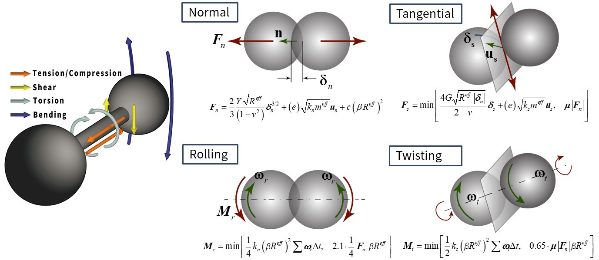
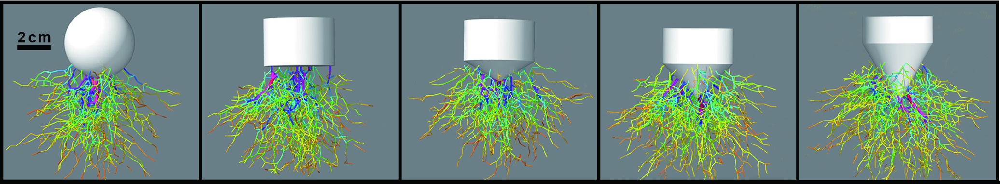

Gallery
=======

This is a blog-style collection of multimedia items related to DEMBody (graphics, animations, etc.). These items display an incomplete feature list of DEMBody, including cohesion bridges, polyhedron contact, non-spherical particle elements, irregular gravity field, force chain identification, shear/periodic boundary, and so on. You are welcome to use these items in presentations so long as they are appropriately cited.

Basic mechanical model
----------------------

.. table:: Mechanical models used in DEMBody
   :widths: auto
   :align: center
   
   =======================  ============================================================= 
   Component                 Description
   =======================  ============================================================= 
   Normal					           Hertz model, spring-dashpot [#f1]_:sup:`,` [#f2]_
   Tangential		             Mindlin model, spring-dashpot-slider [#f1]_:sup:`,` [#f2]_
   Rolling			             Jiang model, spring-dashpot-slider [#f3]_
   Twisting                  Jiang model, spring-dashpot-slider [#f3]_
   Juncture                  Scheeres model, dry cohesion bridge [#f4]_:sup:`,` [#f5]_
   =======================  ============================================================= 

.. rubric:: References

.. [#f1] Cundall, P. A., & Strack, O. D. (1979). A discrete numerical model for granular assemblies. geotechnique, 29(1), 47-65.
.. [#f2] Wada, K., Senshu, H., & Matsui, T. (2006). Numerical simulation of impact cratering on granular material. Icarus, 180(2), 528-545.
.. [#f3] Jiang, M., Shen, Z., & Wang, J. (2015). A novel three-dimensional contact model for granulates incorporating rolling and twisting resistances. Computers and Geotechnics, 65, 147-163.
.. [#f4] Sánchez, P., & Scheeres, D. J. (2014). The strength of regolith and rubble pile asteroids. Meteoritics & Planetary Science, 49(5), 788-811.
.. [#f5] Zhang, Y., Richardson, D. C., Barnouin, O. S., Michel, P., Schwartz, S. R., & Ballouz, R. L. (2018). Rotational failure of rubble-pile bodies: influences of shear and cohesive strengths. The Astrophysical Journal, 857(1), 15.

Classical granular experiments
------------------------------

.. list-table::
   :widths: 10 10

   * - .. figure:: _static/Hopper.gif
          :height: 250px
          :align: center

          Funnel discharge and pile-up of a sandpile.

     - .. figure:: _static/Pouring.gif
          :height: 250px
          :align: center

          Pouring particles into a box.

.. list-table::
   :widths: 10 10

   * - .. figure:: _static/landslide.gif
          :height: 250px
          :align: center

          Brazil-nut effect showing large boulders shaken to the top of a granular bed.

     - .. figure:: _static/landslide.gif
          :height: 250px
          :align: center

          Size-segration during bidisperse granular avalanches.

Single particle tests
---------------------

.. list-table:: 
   :widths: 10 10

   * - .. figure:: _static/DEMBodyLogo.png
          :height: 100px

          A sphere with a intial horizon velocity moving on a plane without rolling friction.

     - .. figure:: _static/DEMBodyLogo.png
          :height: 100px

          A sphere with a intial horizon velocity moving on a plane with rolling friction.

   * - .. figure:: _static/DEMBodyLogo.png
          :height: 100px

          A sphere falling on a inclined plane without rolling friction.

     - .. figure:: _static/DEMBodyLogo.png
          :height: 100px

          A sphere falling on a inclined plane with rolling friction.          
 

Cohesion bridges
----------------

Polyhedron contact
------------------

Triangular meshes for specifying boundary walls and movable bodies. 6-DOF enabled.

.. list-table::
   :widths: 10 10 10

   * - .. figure:: _static/cone.gif
          :height: 150px
          :align: center

          A cone dropping onto a granular bed.

     - .. figure:: _static/hemisphere.gif
          :height: 150px
          :align: center

          A hemisphere dropping onto a granular bed.

     - .. figure:: _static/cylinder.gif
          :height: 150px
          :align: center

          A cylinder dropping onto a granular bed.

.. list-table::
   :widths: 10 10

   * - .. figure:: _static/RoverHopping.gif
          :height: 200px
          :align: center

          Small body rover showing hopping manoeuvre.

     - .. figure:: _static/RoverTumbling.gif
          :height: 200px
          :align: center

          Small body rover showing tumbling manoeuvre.

non-spherical particle elements
-------------------------------

Bonded particles to model realistic shape and particle inertia.

.. list-table::
   :widths: 10 10 10 10

   * - .. figure:: _static/square.png
          :height: 120px

     - .. figure:: _static/stripe.png
          :height: 120px

     - .. figure:: _static/triangle.png
          :height: 120px

     - .. figure:: _static/ball.png
          :height: 120px

irregular gravity field
-----------------------

Simulating dynamics of particle sysyem in the vicinity of asteroids needs to calculate irregular gravity fields.

.. figure:: _static/gravityField.png
   :height: 130px
   :align: center

   Global map of surface gravity across three typical asteroids (Bennu, Itokawa and Eros).

force chain identification
--------------------------

Force chains form heterogeneous structures that determine the mechanical behavior of granular systems.

   Force chains excited by intruders of different shapes impacting on granular medium:

shear/periodic boundary
-----------------------

