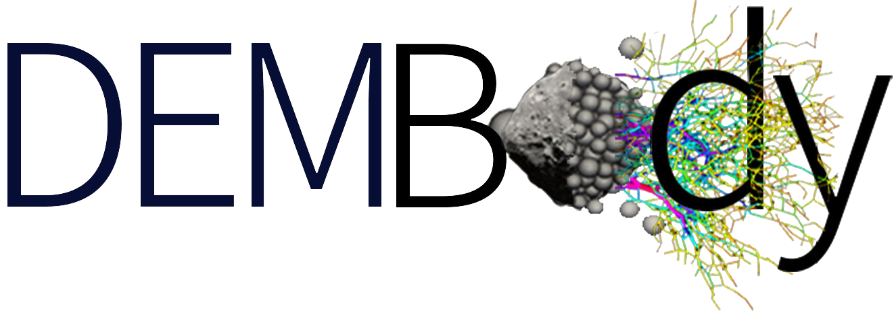

**We are sorry that DEMBody is not ready for open source as this website is still under development now, but it will be published soon!**

Welcome to DEMBody!
===================
DEMBody is Open Source software for Granular Dynamics Simulation for Planetary Science and Geophysics. 

DEMBody stands for Discrete Element Model Body, which incorporates classical granular dynamics simulations and N-body self-gravity calculation. The software focus on investigation of geological features, surface evolution and in-situ exploration on small celestial bodies, e.g., size sorting/segregation on asteroids, mass creeping/wasting during geological processes and locomotion dynamics of the small body lander/rover on granular regolith. But it can be easily customized to accurately and efficiently solve other problems in astrophysics, e.g., simulating planetesimals, moons, ring or dust particles.

The software implements the Soft-Sphere Discrete Element Model (`SSDEM <https://en.wikipedia.org/wiki/Discrete_element_method>`_), coupled with the `N-body gravity integrator <https://en.wikipedia.org/wiki/N-body_simulation>`_. Parallized with `OpenMP <https://www.openmp.org/>`_ (for shared memory systems) and `MPI <https://www.open-mpi.org/>`_ (for distributed memory systems), DEMBody can execute on supercomputers, clusters or multi-core PCs running a Linux-based (or Windows, but not recommended) operating system.

DEMBody (Fortran version) is fully open-source now and can be downloaded freely from https://github.com/Bin-Cheng-THU/DEMBody.git. The C/C++ version is still under development. We are considering a Python wrapper API and a GPU-accelerated module in the future.

If you use this code or parts of this code for results presented in a scientific publication, we would greatly appreciate a citation eithor to this code or to our published papers listed below.

How to use DEMBody
------------------
These instructions will get you a copy of the project for development and testing purposes.

Please find  details in :ref:`Quick User Guide <Quick User Guide>`.

**Under development...**

Contributors
------------
DEMBody and it's pre-/post-processing tools are developed, distributed and maintained by our team, with major contributions from:

* **Bin Cheng** - Tsinghua University - **Key developer** - chengbin.thu@gmail.com
* **Yang Yu** - Beihang University - *Polyhedron module* - yuyang.thu@gmail.com
* **Yun Zhang** - Tsinghua University - *Initial framework*
* and many others!

DEMBody is open source. We are always willing to welcome new developers interested in contributing to the code. If you need help, please contact Bin Cheng (chengbin.thu@gmail.com).

Papers based on DEMBody
-----------------------
#. Cheng, B., Yu, Y., Asphaug, E., Michel, P., Richardson, D. C., Hirabayashi, M., Yoshikawa, M., & Baoyin, H. Reconstructing the formation history of top-shaped asteroids from the surface boulder distribution, *Nature Astronomy*, 2020, https://doi.org/10.1038/s41550-020-01226-7
#. Cheng, B., Yu, Y., & Baoyin, H. Numerical simulations of the controlled motion of a hopping asteroid lander on the regolith surface, *Monthly Notices of the Royal Astronomical Society*, 2019, https://doi.org/10.1093/mnras/stz633
#. Cheng, B., Yu, Y., & Baoyin, H. Collision-based understanding of the force law in granular impact dynamics, *Physical Review E*, 2018, https://doi.org/10.1103/PhysRevE.98.012901
#. Cheng, B., Yu, Y., & Baoyin, H. Asteroid surface impact sampling: dependence of the cavity morphology and collected mass on projectile shape, *Scientific Reports*, 2017, https://doi.org/10.1038/s41598-017-10681-8

License
-------
DEMBody is free software: you can redistribute it and/or modify it under the terms of the GNU General Public License as published by the Free Software Foundation.

Acknowledgments
---------------
* We thank all colleagues in Laboratory of AstroDynamics at Tsinghua Univerisity for support.
* We thank `LIGGGHTS <https://www.cfdem.com/liggghts-open-source-discrete-element-method-particle-simulation-code>`_, `REBOUND <https://rebound.readthedocs.io/en/latest/index.html>`_, `ESyS-Particle <https://launchpad.net/esys-particle>`_ and other open-sourced particle codes for sharing their data structures, parallelization algorithms, documentations and so on!

Table of Contents
-----------------
.. toctree::
   :maxdepth: 2

   self
   Gallery
   FeaturedWork
   VersionHistory
   quickstart
   api
   link

